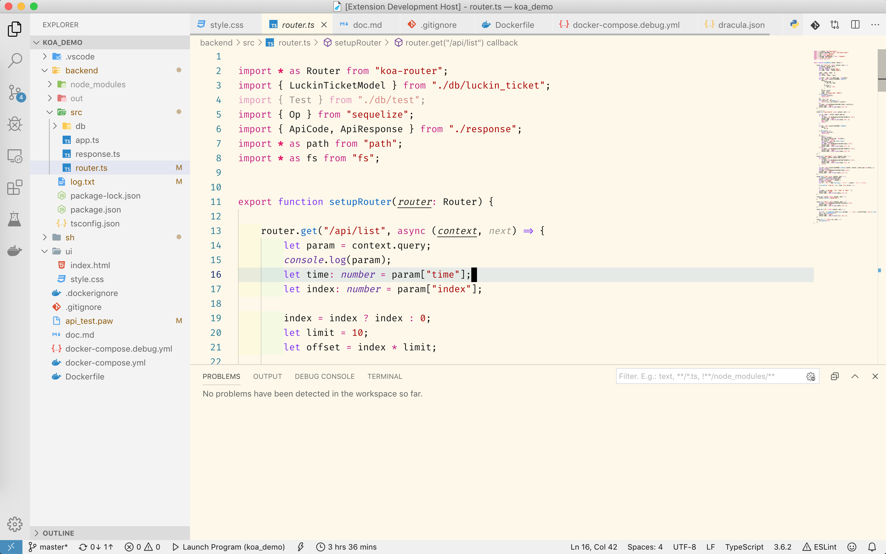

# README
## theme-zxx

a simple light theme.

[source code](https://github.com/RodrigoBecerrilFerreyra/vscode-theme-zxx)

[Original by zenzz](https://github.com/zenzz/vscode-theme-zxx)

Instructions: clone into `%USERPROFILE%\.vscode\extensions` (Windows) or `$HOME/.vscode/extensions` (Mac/Linux) and rename folder to `zenzz.theme-zxx-0.2.2`.

## ScreenShot

**Enjoy!**